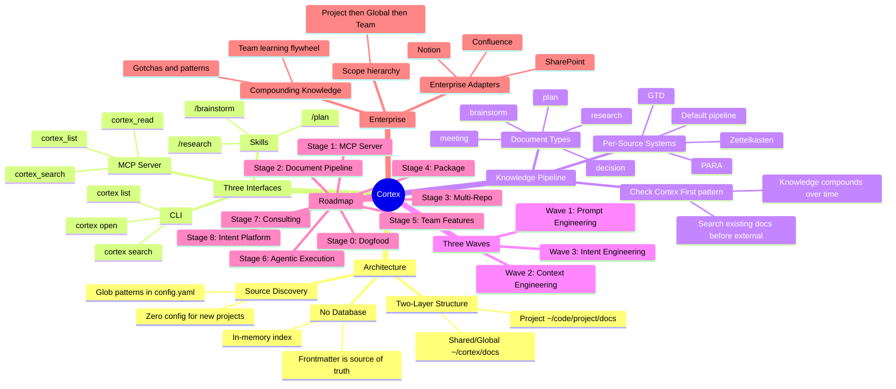

```mermaid
mindmap
  root((Cortex))
    Architecture
      Two-Layer Structure
        Shared/Global ~/cortex/docs
        Project ~/code/project/docs
      No Database
        In-memory index
        Frontmatter is source of truth
      Source Discovery
        Glob patterns in config.yaml
        Zero config for new projects
    Three Interfaces
      MCP Server
        cortex_list
        cortex_search
        cortex_read
      CLI
        cortex list
        cortex search
        cortex open
      Skills
        /research
        /brainstorm
        /plan
    Knowledge Pipeline
      Check Cortex First pattern
        Search existing docs before external
        Knowledge compounds over time
      Document Types
        research
        brainstorm
        plan
        decision
        meeting
      Per-Source Systems
        PARA
        GTD
        Zettelkasten
        Default pipeline
    Three Waves
      Wave 1: Prompt Engineering
      Wave 2: Context Engineering
      Wave 3: Intent Engineering
    Roadmap
      Stage 0: Dogfood
      Stage 1: MCP Server
      Stage 2: Document Pipeline
      Stage 3: Multi-Repo
      Stage 4: Package
      Stage 5: Team Features
      Stage 6: Agentic Execution
      Stage 7: Consulting
      Stage 8: Intent Platform
    Enterprise
      Scope hierarchy
        Project then Global then Team
      Enterprise Adapters
        SharePoint
        Confluence
        Notion
      Compounding Knowledge
        Gotchas and patterns
        Team learning flywheel
```
