# Cortex Global Docs Architecture

Architecture diagram showing the SessionStart bootstrap hook, XDG-compliant config/data split, skill fallback chain, and sub-agent context passing.

Rendered with: neo look, base theme, ELK layout, print CSS injection, `-f -s 2` for 300 DPI PDF.

```mermaid
---
config:
  look: neo
  theme: base
  layout: elk
  elk:
    mergeEdges: true
    nodePlacementStrategy: BRANDES_KOEPF
    considerModelOrder: true
  flowchart:
    useMaxWidth: false
    htmlLabels: true
    curve: basis
    nodeSpacing: 60
    rankSpacing: 60
    diagramPadding: 20
  themeVariables:
    primaryColor: "#dbeafe"
    primaryBorderColor: "#1e40af"
    primaryTextColor: "#0f172a"
    secondaryColor: "#f0fdf4"
    secondaryBorderColor: "#166534"
    tertiaryColor: "#fef3c7"
    tertiaryBorderColor: "#92400e"
    lineColor: "#334155"
    textColor: "#0f172a"
    clusterBkg: "#f8fafc"
    clusterBorder: "#475569"
    edgeLabelBackground: "#ffffff"
    nodeTextColor: "#0f172a"
    fontFamily: "Inter, Helvetica, Arial, sans-serif"
    fontSize: "16px"
---
flowchart TB
    classDef core fill:#dbeafe,stroke:#1e40af,color:#0f172a,stroke-width:2px
    classDef action fill:#e0f2fe,stroke:#0369a1,color:#0f172a,stroke-width:2px
    classDef decision fill:#fee2e2,stroke:#dc2626,color:#0f172a,stroke-width:2px
    classDef success fill:#f0fdf4,stroke:#166534,color:#0f172a,stroke-width:2px
    classDef store fill:#f3e8ff,stroke:#7c3aed,color:#0f172a,stroke-width:2px
    classDef skill fill:#fef3c7,stroke:#92400e,color:#0f172a,stroke-width:2px

    subgraph lifecycle["Session Lifecycle"]
        START["User starts session<br/>or runs /clear"]:::core
        EVENT["SessionStart Event<br/>(matcher: startup|clear)"]:::action
        HOOK["bootstrap.ts<br/>(via Bun)"]:::action
        START --> EVENT --> HOOK
    end

    subgraph bootstrap["Bootstrap Hook"]
        RESOLVE_CONFIG["Resolve config dir<br/>$XDG_CONFIG_HOME/cortex/<br/>or ~/.config/cortex/"]:::action
        CREATE_CONFIG{"config.yaml<br/>exists?"}:::decision
        WRITE["Create config.yaml<br/>(flag: wx, mode: 0o600)"]:::action
        READ["Read config.yaml"]:::action
        REGEX["Extract docs_path<br/>via regex"]:::action
        VALIDATE{"Valid path?<br/>single-line, under $HOME"}:::decision
        RESOLVE_PATH["Use configured path"]:::action
        DEFAULT["Resolve default<br/>$XDG_DATA_HOME/cortex/docs/<br/>or ~/.local/share/cortex/docs/"]:::action
        MKDIRS["Ensure subdirectories exist<br/>(no-op if already created)<br/>research, brainstorms, plans,<br/>decisions, meetings, diagrams"]:::action
        STDOUT["stdout: CORTEX_DOCS_PATH<br/>+ CORTEX_CONFIG<br/>+ Agent Capabilities"]:::success

        RESOLVE_CONFIG --> CREATE_CONFIG
        CREATE_CONFIG -->|No| WRITE --> READ
        CREATE_CONFIG -->|Yes| READ
        READ --> REGEX --> VALIDATE
        VALIDATE -->|Yes| RESOLVE_PATH --> MKDIRS
        VALIDATE -->|No| DEFAULT --> MKDIRS
        MKDIRS --> STDOUT
    end

    subgraph session["Claude Session"]
        CONTEXT["Session Context<br/>injected with resolved path"]:::success
    end

    subgraph skills["Skills (Fallback Chain)"]
        SKILL["Skill invoked<br/>(research, brainstorm,<br/>frontmatter, add)"]:::skill
        CHECK_CTX{"Path in<br/>session context?"}:::decision
        USE_CTX["Use CORTEX_DOCS_PATH"]:::action
        READ_CFG["Read config.yaml<br/>directly"]:::action
        CHECK_CFG{"Config<br/>exists?"}:::decision
        USE_CFG["Use config docs_path"]:::action
        USE_DEFAULT["Use default<br/>~/.local/share/cortex/docs/"]:::action
        SAVE["Save/search docs"]:::success

        SKILL --> CHECK_CTX
        CHECK_CTX -->|Yes| USE_CTX --> SAVE
        CHECK_CTX -->|No| READ_CFG --> CHECK_CFG
        CHECK_CFG -->|Yes| USE_CFG --> SAVE
        CHECK_CFG -->|No| USE_DEFAULT --> SAVE
    end

    subgraph subagents["Sub-agents"]
        SUBAGENT["Sub-agent<br/>(no session context)"]:::skill
        SAVE2["Save/search docs<br/>at injected path"]:::success
        SUBAGENT --> SAVE2
    end

    subgraph filesystem["File System"]
        CONFIG_DIR[("~/.config/cortex/<br/>config.yaml")]:::store
        DATA_DIR[("~/.local/share/cortex/<br/>docs/")]:::store
    end

    %% Cross-subgraph connections
    HOOK --> RESOLVE_CONFIG
    STDOUT --> CONTEXT
    CONTEXT -.-> SKILL
    SKILL -.->|"Task prompt includes<br/>CORTEX_DOCS_PATH"| SUBAGENT
    RESOLVE_CONFIG -.-> CONFIG_DIR
    MKDIRS -.-> DATA_DIR
    SAVE -.-> DATA_DIR
    SAVE2 -.-> DATA_DIR

    %% Subgraph styles (classDef doesn't apply to subgraphs)
    style lifecycle fill:#f8fafc,stroke:#475569,stroke-width:2px,color:#1e293b
    style bootstrap fill:#f8fafc,stroke:#475569,stroke-width:2px,color:#1e293b
    style session fill:#f0fdf4,stroke:#86efac,stroke-width:2px,color:#166534
    style skills fill:#fef9f0,stroke:#d97706,stroke-width:2px,stroke-dasharray:5 5,color:#92400e
    style subagents fill:#fef9f0,stroke:#d97706,stroke-width:1px,stroke-dasharray:5 5,color:#92400e
    style filesystem fill:#f3e8ff,stroke:#c4b5fd,stroke-width:2px,stroke-dasharray:5 5,color:#5b21b6
```

