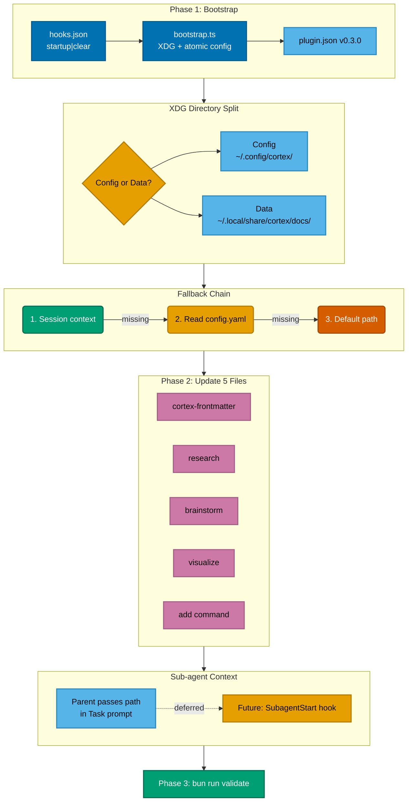

# Configurable Global Docs Storage Plan

Implementation flow for the Cortex configurable global docs feature. Shows the 3-phase plan: bootstrap hook with XDG-compliant directory split, fallback chain for path resolution, skill/command updates, sub-agent context passing, and verification.

**Preset:** Classic (bold colors, clean lines)
**Paper:** A4 landscape

