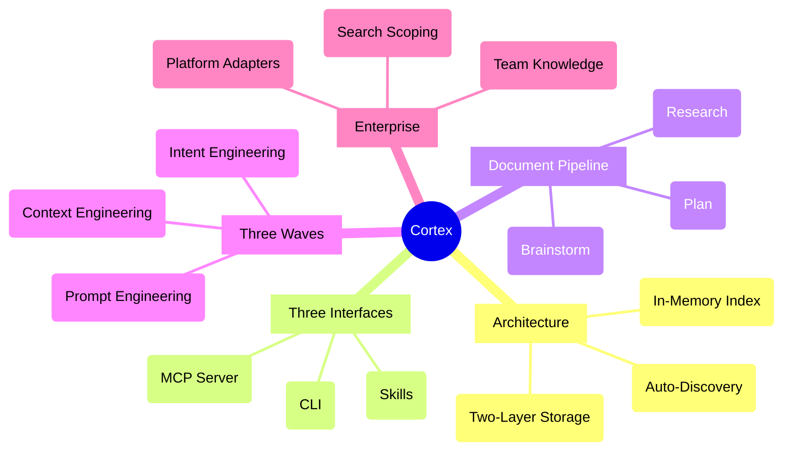

# Cortex -- Agent-Native Knowledge System

```mermaid
mindmap
    root((Cortex))
        [Architecture]
            (Two-Layer Storage)
            (In-Memory Index)
            (Auto-Discovery)
        [Three Interfaces]
            (MCP Server)
            (CLI)
            (Skills)
        [Document Pipeline]
            (Research)
            (Brainstorm)
            (Plan)
        [Three Waves]
            (Prompt Engineering)
            (Context Engineering)
            (Intent Engineering)
        [Enterprise]
            (Team Knowledge)
            (Platform Adapters)
            (Search Scoping)
```
