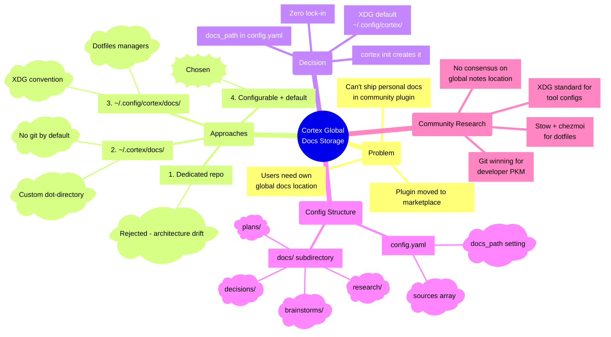

# Cortex Global Docs Storage

Mind map of the brainstorm exploring where Cortex global docs should live after the plugin moved from a standalone repo into side-quest-marketplace.

**Preset:** Sketch (warm tones, hand-drawn feel)
**Paper:** A4 landscape

