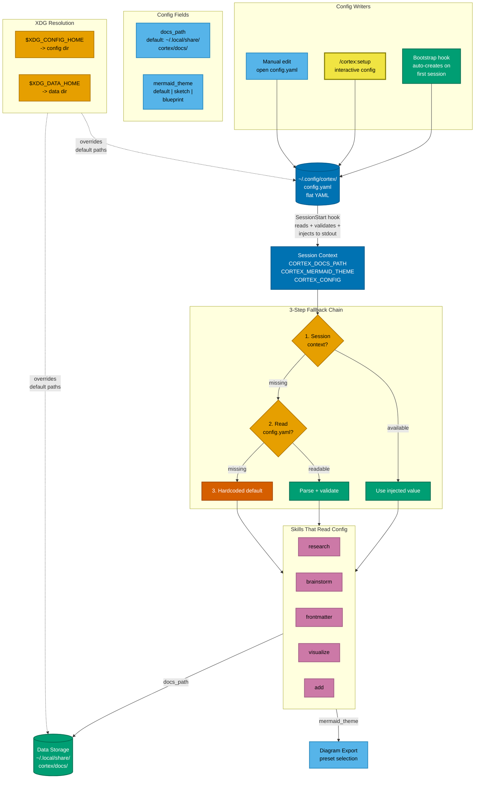

# Config Fallback Chain

How the Cortex unified config system resolves values -- where config is written, how it flows through the SessionStart hook into session context, and the 3-step fallback chain that skills use to read values.

