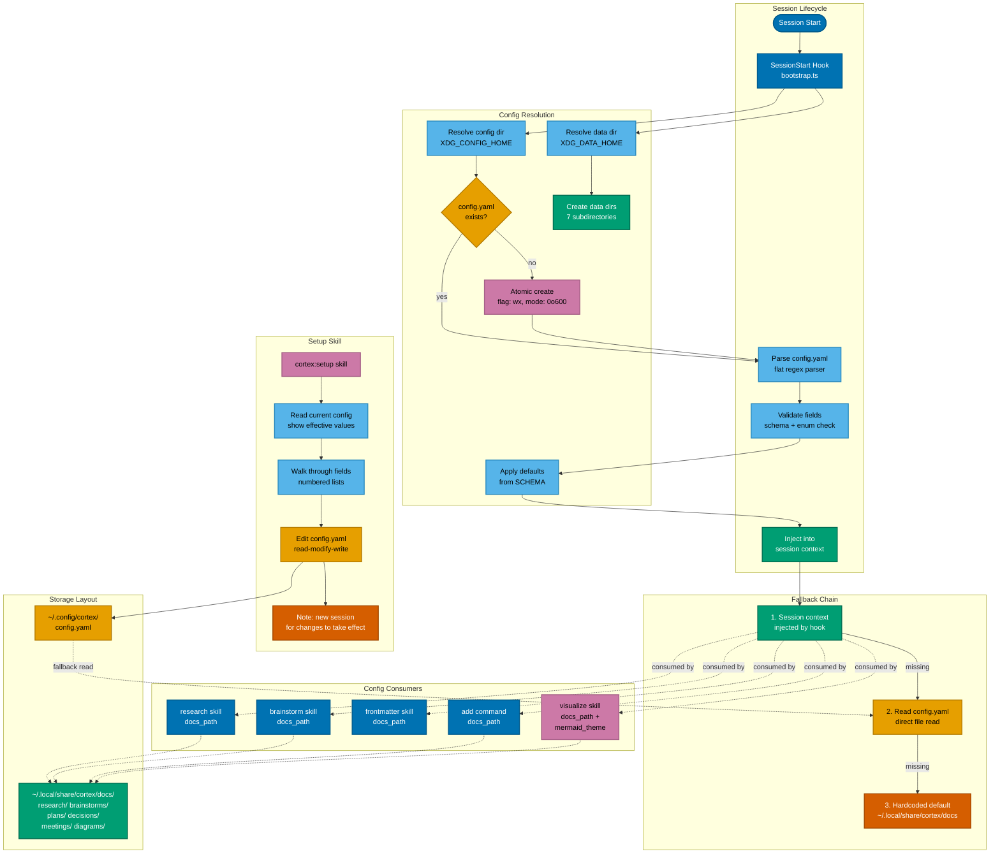

# Unified Config System

Shows the full lifecycle of the Cortex unified config system: SessionStart hook bootstrapping, config resolution with XDG compliance, the 3-step fallback chain, the `/cortex:setup` interactive skill, and how 5 consumer skills read resolved config values. Storage is split XDG-correctly between `~/.config/cortex/` (config) and `~/.local/share/cortex/docs/` (data).

## Flowchart

**Export:** Classic theme, A4 landscape.
