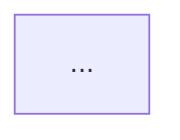

# fix: Multi-diagram index.md convention

## Enhancement Summary

**Deepened on:** 2026-03-02
**Review agents used:** code-simplicity-reviewer, architecture-strategist, pattern-recognition-specialist, skill-authoring specialist

### Key Improvements

1. **`source:` is always a YAML list** -- eliminates polymorphic string|list contract. Consistent with `tags:` convention already in use. Zero consumer branching logic needed.
2. **Malformed detection branch cut** -- YAGNI. Only the visualize skill writes `type: diagram` index files. If an index.md exists without `type: diagram`, it's not ours -- overwrite with confirmation.
3. **Re-render and index.md write responsibilities cleanly separated** -- step 1 handles detection/selection, step 5 handles all index.md writes (first write, append, and section replacement).
4. **Label derivation fallback rule** -- unknown Mermaid types get Title Case of file slug, so the mapping table doesn't need to enumerate every future type.
5. **Old template explicitly retired** -- the `## Source / ## Diagram / ## Export Notes` structure from the frontmatter skill is superseded by `## <Label>` sections.

### New Considerations Discovered

- Section boundary invariant defined: a `## <Label>` section spans from its heading to the next `## ` heading or EOF. Everything within (fenced block + export note) is owned by that section.
- Collision prompt should describe full destructive scope: "This replaces the .mmd file AND the matching section in index.md."
- Label derivation fallback prevents the mapping table from becoming a maintenance burden as Mermaid adds new diagram types.

## Overview

The visualize skill's step 5 says "Multiple diagram types can coexist in the same directory without collision" but `index.md` only embeds one diagram's source. Adding a second type silently overwrites `index.md`, losing the first diagram's embedded source and description. This plan defines the convention for multi-diagram directories and updates both the visualize skill and frontmatter skill.

## Problem Statement

1. **Silent overwrite** -- Adding a second diagram type to an existing directory replaces `index.md` with only the new diagram's content. The first diagram's embedded Mermaid source and description are lost.

2. **No read-before-write protocol** -- The skill's step 3 checkpoint says "Save `index.md`" but has no instruction to check whether `index.md` already exists and contains other diagrams.

3. **Inconsistent first-write structure** -- The first diagram uses bare body text (description + fenced block). If a second diagram uses `## <Type>` section headings, the file has mixed structure.

4. **Re-render shortcut is ambiguous** -- When a directory has multiple `.mmd` files, the re-render shortcut ("read the existing .mmd file") doesn't specify which one.

5. **No human-readable labels** -- The type-to-slug table maps to file slugs (`er`, `c4`) but section headings need readable labels ("Entity-Relationship Diagram").

## Proposed Solution

### Core convention: Uniform section structure from first write

Every diagram in `index.md` gets a `## <Label>` section heading, even the first one. The intro paragraph is directory-level context (topic description), not diagram-specific.

**Rule:** Every `index.md` for `type: diagram` MUST use `## <Label>` section headings from the first write. No bare body text for diagram content. This ensures append never needs to restructure existing content.

**Section boundary invariant:** A `## <Label>` section spans from its heading to the next `## ` heading or EOF. The section contains exactly: the fenced mermaid code block and the `**Export:**` line. Everything within that boundary is owned by the section and can be replaced atomically.

**Single-diagram example:**

```markdown
---
created: 2026-03-02
title: "Unified Config System"
type: diagram
tags: [cortex, config, architecture]
project: side-quest-marketplace
status: draft
source:
  - docs/plans/2026-03-02-feat-cortex-unified-config-system-plan.md
---

# Unified Config System

Shows the config system architecture for the cortex-engineering plugin.

## Flowchart



**Export:** Classic theme, A4 landscape.
```

**Multi-diagram example (after appending):**

```markdown
---
created: 2026-03-02
updated: 2026-03-02
title: "Unified Config System"
type: diagram
tags: [cortex, config, architecture]
project: side-quest-marketplace
status: draft
source:
  - docs/plans/2026-03-02-feat-cortex-unified-config-system-plan.md
  - docs/brainstorms/2026-02-28-cortex-global-docs-storage.md
---

# Unified Config System

Shows the config system architecture for the cortex-engineering plugin.

## Flowchart


**Export:** Classic theme, A4 landscape.

## Mind Map


**Export:** Classic theme, A4 landscape.
```

### Key decisions

1. **Section heading uses human-readable label** -- `## Flowchart`, `## Mind Map`, `## Entity-Relationship Diagram` (not `## flowchart`, `## er`)
2. **Export notes are per-diagram** -- `**Export:** <preset> theme, <paper> size.` immediately after each fenced block
3. **`source:` is always a YAML list** -- even for single sources. Consistent with `tags:` convention. Zero consumer branching needed. Example: `source:\n  - docs/plans/my-plan.md`
4. **`updated:` added on append** -- set when `index.md` is modified after initial creation
5. **`title:` is topic-level** -- "Unified Config System" not "Unified Config System Diagram" (the `type: diagram` field already signals doc type)
6. **Two-path detection** -- if `index.md` exists with `type: diagram` frontmatter, use append mode. Otherwise (no file, or file without `type: diagram`), use first-write mode with confirmation if overwriting.
7. **Old template retired** -- the `## Source / ## Diagram / ## Export Notes` structure previously in the frontmatter skill is superseded by `## <Label>` sections. Remove it from the frontmatter skill's diagram doc type.

## Technical Approach

### Detection logic (step 5 -- index.md write)

```
Before writing index.md:
  1. Check if index.md exists in the target directory
  2. If no: FIRST WRITE -- create with uniform section structure
  3. If yes: read frontmatter
     a. If frontmatter has `type: diagram`: APPEND MODE
        - Check if a section heading matching this type label already exists
        - If yes: REPLACE that section's content (fenced block + export note)
        - If no: append new section after last diagram section
        - Add source to `source:` list if not already present
        - Set `updated:` date
     b. Otherwise: confirm overwrite with user, then first-write
```

### Label derivation (add to SKILL.md step 5)

**Fallback rule:** If the Mermaid type is not in the mapping table, derive the label by Title Casing the file slug. Example: a future `waterfall` type with slug `waterfall` becomes section heading `## Waterfall`.

| Mermaid type | File slug | Section heading label |
|---|---|---|
| flowchart / graph | `flowchart` | Flowchart |
| sequence | `sequence` | Sequence Diagram |
| class | `class` | Class Diagram |
| state | `state` | State Diagram |
| erDiagram | `er` | Entity-Relationship Diagram |
| gantt | `gantt` | Gantt Chart |
| pie | `pie` | Pie Chart |
| mindmap | `mindmap` | Mind Map |
| timeline | `timeline` | Timeline |
| architecture | `architecture` | Architecture Diagram |
| block | `block` | Block Diagram |
| quadrant | `quadrant` | Quadrant Chart |
| sankey | `sankey` | Sankey Diagram |
| xychart | `xychart` | XY Chart |
| gitGraph | `git` | Git Graph |
| C4Context | `c4` | C4 Context Diagram |
| kanban | `kanban` | Kanban Board |
| packet | `packet` | Packet Diagram |
| requirement | `requirement` | Requirement Diagram |
| radar | `radar` | Radar Chart |

### Re-render shortcut (step 1 -- detection only)

Update the re-render shortcut in step 1:

**Current:**
> If the source is an existing diagram, read the existing `.mmd` file and skip to step 4.

**Updated:**
> If the source is an existing diagram directory (index.md with `type: diagram`):
> - If directory contains exactly one `.mmd` file: read it and skip to step 4
> - If directory contains multiple `.mmd` files: list them and ask which to re-render

Step 1 only handles detection and .mmd file selection. After re-export in step 4, step 5 handles updating the matching section in index.md.

### Overwrite collision + index.md interaction (step 5)

Update the existing collision block to describe full destructive scope:

> When "Overwrite existing" is chosen for a same-type collision:
> - Replace the `<type>.mmd` file with new Mermaid source
> - Replace the `<type>.svg` and `<type>.pdf` with new exports
> - Find and replace the matching `## <Label>` section in index.md (fenced block + export note)
> - If the section doesn't exist in index.md, append it

### Frontmatter skill updates

Update the `diagram` doc type in `skills/frontmatter/SKILL.md`:

1. **`source:` field** -- always a YAML list, even for single sources. Example: `source:\n  - path/to/source.md`
2. **`updated:` field** -- set on edit (already in base schema, just ensure it's mentioned for diagram type)
3. **Section structure** -- add "Diagrams use `## <Label>` sections for each diagram type. Export notes as `**Export:**` line after each fenced block."
4. **Retire old template** -- remove the `## Source / ## Diagram / ## Export Notes` structure from the diagram doc type, replaced by the `## <Label>` convention

## System-Wide Impact

- **Interaction graph:** visualize skill writes index.md -> frontmatter skill defines the contract -> any future skill reading index.md gets `source:` as a list (always)
- **State lifecycle risks:** append mode could produce duplicate sections if the same type heading appears twice. Deduplication via heading match prevents this (replace, not append).
- **API surface parity:** only the visualize skill writes to index.md for diagrams. No other skill needs updating.
- **Section boundary contract:** any tool or skill that reads `## <Label>` sections can rely on the invariant: heading -> fenced block -> export note -> next heading or EOF.

## Acceptance Criteria

- [x] First diagram writes index.md with `## <Label>` section heading (uniform from first write)
- [x] Second+ diagram appends new `## <Label>` section; same-type replaces matching section
- [x] `source:` is always a YAML list in diagram frontmatter
- [x] Re-render shortcut prompts for type selection when multiple `.mmd` files exist
- [x] Label mapping table with fallback rule added to SKILL.md step 5
- [x] Old `## Source / ## Diagram / ## Export Notes` template retired from frontmatter skill
- [x] `bun run validate` passes

## Dependencies & Risks

- **Low risk** -- changes are entirely within skill text (SKILL.md files). No code, no hooks, no tests affected.
- **Existing diagrams** -- the `2026-03-02-unified-config-system/index.md` doesn't use the new section heading convention. This is a non-issue since it's the only diagram directory and can be reformatted in this PR.

## What's NOT in This Plan

- **Orphan detection** -- warning when index.md references a deleted `.mmd` file. Reasonable default: do nothing. Add when it becomes a pain point.
- **Automatic reconciliation** -- no "prune orphaned sections" flow. Manual edit is sufficient.
- **Per-diagram frontmatter** -- each diagram does not get its own frontmatter. Directory-level frontmatter covers all diagrams.
- **Malformed index.md recovery** -- no special handling for corrupted or hand-edited index.md files. If `type: diagram` is absent, treat as first-write with overwrite confirmation.

## Files Changed Summary

| File | Change Type |
|------|------------|
| `plugins/cortex-engineering/skills/visualize/SKILL.md` | EDIT -- step 1 (re-render), step 3 (checkpoint), step 5 (section structure, labels, collision, detection logic) |
| `plugins/cortex-engineering/skills/frontmatter/SKILL.md` | EDIT -- diagram doc type: source always-list, section structure, retire old template |
| `docs/diagrams/2026-03-02-unified-config-system/index.md` | EDIT -- reformat to new section heading convention, source as list |

## Sources & References

### Internal References

- `plugins/cortex-engineering/skills/visualize/SKILL.md` -- current save convention (step 5)
- `plugins/cortex-engineering/skills/frontmatter/SKILL.md` -- diagram doc type definition
- `docs/diagrams/2026-03-02-unified-config-system/index.md` -- only existing diagram directory

### External References

- [mermaid-cli #656](https://github.com/mermaid-js/mermaid-cli/issues/656) -- PDF color fix (related, already fixed)
- [mermaid-cli #585](https://github.com/mermaid-js/mermaid-cli/issues/585) -- PDF text color issue (related, already fixed)
