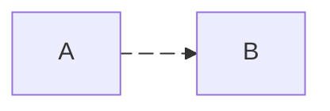
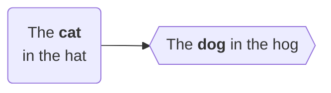

# Mermaid.js Config & Theming - Technical Reference

> Scraped 2026-03-01 from mermaid.js.org documentation.
> For building a skill about designing SVG diagrams with mmdc.

---

## 1. Main Config Schema (`config.schema.json`)

Source: https://mermaid.js.org/config/schema-docs/config.html

### Top-Level Properties

| Property | Type | Required | Default | Description |
|---|---|---|---|---|
| `theme` | `string` (enum) | Optional | `"default"` | CSS theme. Values: `"default"`, `"base"`, `"dark"`, `"forest"`, `"neutral"`, `"null"` (disables pre-defined theme) |
| `themeVariables` | `any` | Optional | - | Object for customizing theme colors (only works with `base` theme) |
| `themeCSS` | `string` | Optional | - | Raw CSS string to override theme |
| `look` | `string` (enum) | Required | `"classic"` | Main look. Values: `"classic"`, `"handDrawn"` |
| `handDrawnSeed` | `number` | Optional | `0` | Seed for handDrawn look (0 = random). Important for deterministic test output |
| `layout` | `string` | Optional | `"dagre"` | Layout algorithm. Common values: `"dagre"`, `"elk"` |
| `maxTextSize` | `number` | Optional | `50000` | Max allowed size of user's text diagram |
| `maxEdges` | `integer` (min: 0) | Optional | `500` | Max edges in a graph |
| `elk` | `object` | Optional | - | ELK layout engine config (see section 5) |
| `darkMode` | `boolean` | Optional | `false` | Affects derived color calculations |
| `htmlLabels` | `boolean` | Optional | - | Whether HTML tags render edge labels |
| `fontFamily` | `string` | Required | `"trebuchet ms", verdana, arial, sans-serif;` | CSS font-family for diagrams |
| `altFontFamily` | `string` | Optional | - | Alternative font family |
| `logLevel` | `string\|number` (enum) | Required | `5` ("fatal") | Logging level. Values: `"trace"`/0, `"debug"`/1, `"info"`/2, `"warn"`/3, `"error"`/4, `"fatal"`/5 |
| `securityLevel` | `string` (enum) | Required | `"strict"` | Trust level. Values: `"strict"` (default, HTML encoded, clicks disabled), `"loose"` (HTML allowed, clicks enabled), `"antiscript"` (HTML allowed except script), `"sandbox"` (sandboxed iframe) |
| `startOnLoad` | `boolean` | Required | `true` | Auto-start on page load |
| `arrowMarkerAbsolute` | `boolean` | Required | `false` | Arrow markers as absolute paths vs anchors (matters with base tag) |
| `secure` | `string[]` | Optional | `["secure", "securityLevel", "startOnLoad", "maxTextSize", "suppressErrorRendering", "maxEdges"]` | Keys that can only be changed via initialize() |
| `legacyMathML` | `boolean` | Optional | `false` | Fall back to KaTeX for MathML |
| `forceLegacyMathML` | `boolean` | Optional | `false` | Force KaTeX stylesheet for MathML rendering |
| `deterministicIds` | `boolean` | Optional | `false` | Generate SVG node IDs based on seed (not date). Good for source control |
| `deterministicIDSeed` | `string` | Optional | - | Seed string for deterministic IDs |
| `wrap` | `boolean` | Optional | - | Text wrapping |
| `fontSize` | `number` | Optional | `16` | Font size in pixels |
| `markdownAutoWrap` | `boolean` | Optional | `true` | Auto-wrap markdown text |
| `suppressErrorRendering` | `boolean` | Optional | `false` | Suppress 'Syntax error' diagram in DOM |
| `dompurifyConfig` | `object` | Optional | - | Config passed to dompurify library |

### Diagram-Specific Config Sub-Objects

Each is an `object` extending `BaseDiagramConfig`:

| Property | Type | Description |
|---|---|---|
| `flowchart` | `FlowchartDiagramConfig` | Flowchart-specific config |
| `sequence` | `SequenceDiagramConfig` | Sequence diagram config |
| `gantt` | `GanttDiagramConfig` | Gantt diagram config |
| `journey` | `JourneyDiagramConfig` | Journey diagram config |
| `timeline` | `TimelineDiagramConfig` | Timeline diagram config |
| `class` | `ClassDiagramConfig` | Class diagram config |
| `state` | `StateDiagramConfig` | State diagram config |
| `er` | `ErDiagramConfig` | ER diagram config |
| `pie` | `PieDiagramConfig` | Pie diagram config |
| `quadrantChart` | `QuadrantChartConfig` | Quadrant chart config |
| `xyChart` | `XYChartConfig` | XY chart config |
| `requirement` | `RequirementDiagramConfig` | Requirement diagram config |
| `architecture` | `ArchitectureDiagramConfig` | Architecture diagram config |
| `mindmap` | `MindmapDiagramConfig` | Mindmap diagram config |
| `kanban` | `KanbanDiagramConfig` | Kanban diagram config |
| `gitGraph` | `GitGraphDiagramConfig` | Git graph diagram config |
| `c4` | `C4DiagramConfig` | C4 diagram config |
| `sankey` | `SankeyDiagramConfig` | Sankey diagram config |
| `packet` | `PacketDiagramConfig` | Packet diagram config |
| `block` | `BlockDiagramConfig` | Block diagram config |
| `radar` | `RadarDiagramConfig` | Radar diagram config |

---

## 2. Base Diagram Config

Source: https://mermaid.js.org/config/schema-docs/config-defs-base-diagram-config.html

All diagram configs extend this base.

| Property | Type | Required | Default | Description |
|---|---|---|---|---|
| `useWidth` | `number` | Optional | - | Fixed width |
| `useMaxWidth` | `boolean` | Optional | `true` | When true, height/width set to 100% and scales with available space. When false, uses absolute space required |

---

## 3. Flowchart Diagram Config

Source: https://mermaid.js.org/config/schema-docs/config-defs-flowchart-diagram-config.html

Extends `BaseDiagramConfig`. The object containing configurations specific for flowcharts.

| Property | Type | Required | Default | Description |
|---|---|---|---|---|
| `titleTopMargin` | `integer` (min: 0) | Required | `25` | Margin top for text above diagram |
| `subGraphTitleMargin` | `object` | Required | `{"top": 0, "bottom": 0}` | Top/bottom margin for subgraph titles (see section 7) |
| `arrowMarkerAbsolute` | `boolean` | Optional | - | Arrow marker paths |
| `diagramPadding` | `integer` (min: 0) | Required | `20` | Padding around entire diagram in pixels |
| `htmlLabels` | `boolean` | Required | `true` | Use HTML tags for edge label rendering |
| `nodeSpacing` | `integer` (min: 0) | Required | `50` | Spacing between nodes on same level. Horizontal for TB/BT, vertical for LR/RL |
| `rankSpacing` | `integer` (min: 0) | Required | `50` | Spacing between nodes on different levels |
| `curve` | `string` (enum) | Required | `"basis"` | Curve style for edges. Values: `"basis"`, `"bumpX"`, `"bumpY"`, `"cardinal"`, `"catmullRom"`, `"linear"`, `"monotoneX"`, `"monotoneY"`, `"natural"`, `"step"`, `"stepAfter"`, `"stepBefore"` |
| `padding` | `number` | Optional | `15` | Padding between labels and shape. **Only used in new experimental rendering** |
| `defaultRenderer` | `string` (enum) | Required | `"dagre-wrapper"` | Rendering engine. Values: `"dagre-d3"` (dagre-d3-es library), `"dagre-wrapper"` (mermaid wrapper for dagre), `"elk"` (elkjs layout) |
| `wrappingWidth` | `number` | Required | `200` | Max width before text wraps to new line (for markdown strings) |
| `inheritDir` | `boolean` | Optional | `false` | If true, subgraphs without explicit direction inherit the global graph direction |

---

## 4. Theme Configuration

Source: https://mermaid.js.org/config/theming.html

### Available Themes

1. **`default`** - Default theme for all diagrams
2. **`neutral`** - Great for black/white print documents
3. **`dark`** - Dark-colored elements / dark-mode
4. **`forest`** - Shades of green
5. **`base`** - **The ONLY theme that can be modified** via themeVariables

### Applying Themes

**Site-wide:**
```javascript
mermaid.initialize({ theme: 'base' });
```

**Per-diagram (frontmatter):**
```yaml
---
config:
  theme: 'forest'
---
graph TD
  a --> b
```

### Customizing with themeVariables

**IMPORTANT:** Only the `base` theme supports customization.

```yaml
---
config:
  theme: 'base'
  themeVariables:
    primaryColor: '#BB2528'
    primaryTextColor: '#fff'
    primaryBorderColor: '#7C0000'
    lineColor: '#F8B229'
    secondaryColor: '#006100'
    tertiaryColor: '#fff'
---
```

### Color System Notes

- The theming engine **only recognizes hex colors**, not color names (`#ff0000` works, `red` does not)
- Many variables are auto-calculated from base variables (inversions, hue changes, darken/lighten by 10%)
- `primaryBorderColor` is derived from `primaryColor`, etc.

### Core Theme Variables

| Variable | Default | Description |
|---|---|---|
| `darkMode` | `false` | Affects derived color calculations |
| `background` | `#f4f4f4` | Background color / contrast reference |
| `fontFamily` | `trebuchet ms, verdana, arial` | Diagram text font |
| `fontSize` | `16px` | Font size |
| `primaryColor` | `#fff4dd` | Node background base color. Other colors derived from this |
| `primaryTextColor` | calculated (`#ddd`/`#333` based on darkMode) | Text in primary nodes |
| `secondaryColor` | calculated from primaryColor | Secondary elements |
| `primaryBorderColor` | calculated from primaryColor | Primary node borders |
| `secondaryBorderColor` | calculated from secondaryColor | Secondary node borders |
| `secondaryTextColor` | calculated from secondaryColor | Secondary text |
| `tertiaryColor` | calculated from primaryColor | Tertiary elements |
| `tertiaryBorderColor` | calculated from tertiaryColor | Tertiary borders |
| `tertiaryTextColor` | calculated from tertiaryColor | Tertiary text |
| `noteBkgColor` | `#fff5ad` | Note background |
| `noteTextColor` | `#333` | Note text |
| `noteBorderColor` | calculated from noteBkgColor | Note border |
| `lineColor` | calculated from background | Line color |
| `textColor` | calculated from primaryTextColor | General text on background |
| `mainBkg` | calculated from primaryColor | Background in flowchart objects |
| `errorBkgColor` | tertiaryColor | Syntax error background |
| `errorTextColor` | tertiaryTextColor | Syntax error text |

### Flowchart Theme Variables

| Variable | Default | Description |
|---|---|---|
| `nodeBorder` | primaryBorderColor | Node border color |
| `clusterBkg` | tertiaryColor | Subgraph background |
| `clusterBorder` | tertiaryBorderColor | Cluster border color |
| `defaultLinkColor` | lineColor | Link color |
| `titleColor` | tertiaryTextColor | Title color |
| `edgeLabelBackground` | calculated from secondaryColor | Edge label background |
| `nodeTextColor` | primaryTextColor | Text inside nodes |

### Sequence Diagram Theme Variables

| Variable | Default | Description |
|---|---|---|
| `actorBkg` | mainBkg | Actor background |
| `actorBorder` | primaryBorderColor | Actor border |
| `actorTextColor` | primaryTextColor | Actor text |
| `actorLineColor` | actorBorder | Actor line |
| `signalColor` | textColor | Signal color |
| `signalTextColor` | textColor | Signal text |
| `labelBoxBkgColor` | actorBkg | Label box background |
| `labelBoxBorderColor` | actorBorder | Label box border |
| `labelTextColor` | actorTextColor | Label text |
| `loopTextColor` | actorTextColor | Loop text |
| `activationBorderColor` | calculated from secondaryColor | Activation border |
| `activationBkgColor` | secondaryColor | Activation background |
| `sequenceNumberColor` | calculated from lineColor | Sequence number |

### Pie Diagram Theme Variables

| Variable | Default | Description |
|---|---|---|
| `pie1` through `pie12` | Various (derived from primary/secondary/tertiary) | Fill for pie sections 1-12 |
| `pieTitleTextSize` | `25px` | Title text size |
| `pieTitleTextColor` | taskTextDarkColor | Title text color |
| `pieSectionTextSize` | `17px` | Section label text size |
| `pieSectionTextColor` | textColor | Section label color |
| `pieLegendTextSize` | `17px` | Legend text size |
| `pieLegendTextColor` | taskTextDarkColor | Legend text color |
| `pieStrokeColor` | `black` | Section border color |
| `pieStrokeWidth` | `2px` | Section border width |
| `pieOuterStrokeWidth` | `2px` | Outer circle border width |
| `pieOuterStrokeColor` | `black` | Outer circle border color |
| `pieOpacity` | `0.7` | Section opacity |

### State Diagram Theme Variables

| Variable | Default | Description |
|---|---|---|
| `labelColor` | primaryTextColor | Label color |
| `altBackground` | tertiaryColor | Deep composite state background |

### Class Diagram Theme Variables

| Variable | Default | Description |
|---|---|---|
| `classText` | textColor | Text in class diagrams |

### User Journey Theme Variables

| Variable | Default | Description |
|---|---|---|
| `fillType0` through `fillType7` | Alternating primary/secondary (derived) | Section fills 1-8 |

---

## 5. ELK Layout Config

Source: https://mermaid.js.org/config/schema-docs/config-properties-elk.html

ELK is an alternative layout engine (experimental, better for complex diagrams).

| Property | Type | Required | Default | Description |
|---|---|---|---|---|
| `mergeEdges` | `boolean` | Optional | `false` | Allow edges to share paths where convenient. Makes pretty diagrams but can reduce readability |
| `nodePlacementStrategy` | `string` (enum) | Optional | `"BRANDES_KOEPF"` | Node placement algorithm. Values: `"SIMPLE"`, `"NETWORK_SIMPLEX"`, `"LINEAR_SEGMENTS"`, `"BRANDES_KOEPF"` |
| `cycleBreakingStrategy` | `string` (enum) | Optional | `"GREEDY_MODEL_ORDER"` | How to find and break cycles. Values: `"GREEDY"`, `"DEPTH_FIRST"`, `"INTERACTIVE"`, `"MODEL_ORDER"`, `"GREEDY_MODEL_ORDER"` |
| `forceNodeModelOrder` | `boolean` | Optional | `false` | Node model order not changed during crossing minimization. Assumes model order already respected (set considerModelOrder to NODES_AND_EDGES) |
| `considerModelOrder` | `string` (enum) | Optional | `"NODES_AND_EDGES"` | Preserve model node/edge order if it doesn't cause crossings. Values: `"NONE"`, `"NODES_AND_EDGES"`, `"PREFER_EDGES"`, `"PREFER_NODES"` |

### Using ELK

```yaml
---
config:
  flowchart:
    defaultRenderer: "elk"
---
flowchart LR
  A --> B --> C
```

Or at the global level:
```yaml
---
config:
  layout: "elk"
---
```

---

## 6. Flowchart Syntax Reference

Source: https://mermaid.js.org/syntax/flowchart.html

### Directions

| Code | Direction |
|---|---|
| `TB` / `TD` | Top to Bottom |
| `BT` | Bottom to Top |
| `LR` | Left to Right |
| `RL` | Right to Left |

### Node Shapes (Classic Syntax)

| Syntax | Shape |
|---|---|
| `A` or `A["text"]` | Rectangle (default) |
| `A(text)` | Rounded rectangle |
| `A([text])` | Stadium |
| `A[[text]]` | Subroutine |
| `A[(text)]` | Cylinder (database) |
| `A((text))` | Circle |
| `A>text]` | Asymmetric (flag) |
| `A{text}` | Rhombus (diamond) |
| `A{{text}}` | Hexagon |
| `A[/text/]` | Parallelogram |
| `A[\text\]` | Parallelogram alt |
| `A[/text\]` | Trapezoid |
| `A[\text/]` | Trapezoid alt |
| `A(((text)))` | Double circle |

### Node Shapes (v11.3.0+ Extended Syntax)

General syntax: `A@{ shape: rect, label: "Text" }`

30 new shapes available. Key ones:

| Short Name | Semantic | Aliases |
|---|---|---|
| `rect` | Process/Rectangle | `proc`, `process`, `rectangle` |
| `rounded` | Event | `event` |
| `stadium` | Terminal Point | `pill`, `terminal` |
| `diam` | Decision/Diamond | `decision`, `diamond`, `question` |
| `hex` | Prepare/Hexagon | `hexagon`, `prepare` |
| `cyl` | Database/Cylinder | `cylinder`, `database`, `db` |
| `circle` | Start/Circle | `circ` |
| `sm-circ` | Small Start Circle | `small-circle`, `start` |
| `dbl-circ` | Stop/Double Circle | `double-circle` |
| `fr-circ` | Stop/Framed Circle | `framed-circle`, `stop` |
| `fr-rect` | Subprocess/Framed Rect | `framed-rectangle`, `subproc`, `subprocess`, `subroutine` |
| `doc` | Document | `document` |
| `docs` | Multi-Document/Stacked | `documents`, `st-doc`, `stacked-document` |
| `st-rect` | Multi-Process/Stacked Rect | `processes`, `procs`, `stacked-rectangle` |
| `cloud` | Cloud | `cloud` |
| `notch-rect` | Card/Notched Rect | `card`, `notched-rectangle` |
| `lin-cyl` | Disk Storage/Lined Cyl | `disk`, `lined-cylinder` |
| `lin-rect` | Lined/Shaded Process | `lin-proc`, `lined-process`, `shaded-process` |
| `div-rect` | Divided Process | `div-proc`, `divided-process` |
| `bolt` | Comm Link/Lightning | `com-link`, `lightning-bolt` |
| `brace` | Comment/Curly Brace | `brace-l`, `comment` |
| `text` | Text Block | - |
| `fork` | Fork/Join | `join` |
| `tri` | Extract/Triangle | `extract`, `triangle` |
| `delay` | Delay/Half-Rounded Rect | `half-rounded-rectangle` |
| `h-cyl` | Direct Access Storage | `das`, `horizontal-cylinder` |
| `trap-t` | Manual Operation | `inv-trapezoid`, `manual`, `trapezoid-top` |
| `trap-b` | Priority Action | `priority`, `trapezoid`, `trapezoid-bottom` |
| `sl-rect` | Manual Input | `manual-input`, `sloped-rectangle` |
| `flag` | Paper Tape | `paper-tape` |
| `bow-rect` | Stored Data | `bow-tie-rectangle`, `stored-data` |
| `odd` | Odd Shape | - |
| `tag-doc` | Tagged Document | `tagged-document` |
| `tag-rect` | Tagged Process | `tag-proc`, `tagged-process` |
| `win-pane` | Internal Storage | `internal-storage`, `window-pane` |
| `f-circ` | Junction/Filled Circle | `filled-circle`, `junction` |
| `cross-circ` | Summary/Crossed Circle | `crossed-circle`, `summary` |
| `flip-tri` | Manual File | `flipped-triangle`, `manual-file` |
| `curv-trap` | Display/Curved Trapezoid | `curved-trapezoid`, `display` |
| `notch-pent` | Loop Limit | `loop-limit`, `notched-pentagon` |
| `hourglass` | Collate | `collate`, `hourglass` |
| `bang` | Bang | `bang` |

### Link Types

| Syntax | Type |
|---|---|
| `A --> B` | Arrow |
| `A --- B` | Open (no arrow) |
| `A -.-> B` | Dotted with arrow |
| `A -.- B` | Dotted |
| `A ==> B` | Thick with arrow |
| `A === B` | Thick |
| `A ~~~ B` | Invisible |
| `A --o B` | Circle edge |
| `A --x B` | Cross edge |
| `A o--o B` | Bidirectional circle |
| `A <--> B` | Bidirectional arrow |
| `A x--x B` | Bidirectional cross |

### Link Text

```
A -->|text| B
A -- text --> B
A -. text .-> B
A == text ==> B
A ---|text| B
```

### Link Length

Extra dashes = longer link spanning more ranks:

| Length | Normal | Arrow | Thick | Thick+Arrow | Dotted | Dotted+Arrow |
|---|---|---|---|---|---|---|
| 1 | `---` | `-->` | `===` | `==>` | `-.-` | `-.->` |
| 2 | `----` | `--->` | `====` | `===>` | `-..-` | `-..->` |
| 3 | `-----` | `---->` | `=====` | `====>` | `-...-` | `-...->` |

### Edge IDs (v11.10.0+)



Animation via classDef:
```
classDef animate stroke-dasharray: 9,5,stroke-dashoffset: 900,animation: dash 25s linear infinite;
class e1 animate
```

### Subgraphs

```mermaid
flowchart TB
  subgraph title
    graph definition
  end

  subgraph id1 [Display Title]
    nodes...
  end
```

- Subgraphs can have explicit IDs: `subgraph id [title]`
- Edges can connect to/from subgraphs: `subgraph1 --> subgraph2`
- Nested subgraphs supported
- Direction within subgraphs: `direction TB` / `direction LR` etc.

**Known Limitation:** If any subgraph node links to the outside, subgraph direction is IGNORED and inherits parent direction.

### Styling

**Inline node style:**
```
style id1 fill:#f9f,stroke:#333,stroke-width:4px
style id2 fill:#bbf,stroke:#f66,stroke-width:2px,color:#fff,stroke-dasharray: 5 5
```

**Class definitions:**
```
classDef className fill:#f9f,stroke:#333,stroke-width:4px;
classDef firstClassName,secondClassName font-size:12pt;
```

**Apply class to nodes:**
```
class nodeId1 className;
class nodeId1,nodeId2 className;
A:::someclass --> B
```

**Default class (applies to all unclassed nodes):**
```
classDef default fill:#f9f,stroke:#333,stroke-width:4px;
```

**Link styling (by order number, 0-indexed):**
```
linkStyle 3 stroke:#ff3,stroke-width:4px,color:red;
linkStyle 1,2,7 color:blue;
linkStyle default stroke:#ff3,stroke-width:4px;
```

**Curve styling (diagram-level):**
```yaml
---
config:
  flowchart:
    curve: stepBefore
---
```

**Edge-level curve (v11.10.0+):**
```
A e1@==> B
e1@{ curve: linear }
```

### CSS Classes in HTML

```html
<style>
  .cssClass > rect {
    fill: #ff0000;
    stroke: #ffff00;
    stroke-width: 4px;
  }
</style>
```


### Markdown Strings

Wrap in double quotes + backticks: `"\` text \`"`



Disable auto-wrap:
```yaml
---
config:
  markdownAutoWrap: false
---
```

### FontAwesome Icons

```
B["fa:fa-twitter for peace"]
B-->C[fa:fa-ban forbidden]
```

Supported prefixes: `fa`, `fab`, `fas`, `far`, `fal`, `fad`, `fak` (custom/paid).

### Comments

```
%% This is a comment
```

### Known Issues / Gotchas

1. **"end" keyword:** Never use lowercase `end` as node text - it breaks the parser. Use `End` or `END`
2. **"o"/"x" as first letter:** `A---oB` creates circle edge, `A---xB` creates cross edge. Add space or capitalize: `A--- oB`
3. **Special characters:** Wrap in quotes: `id1["This is (text)"]`
4. **Entity codes:** `#quot;` for double quote, `#9829;` for heart, etc.
5. **Subgraph direction ignored** when any node links outside the subgraph
6. **Commas in classDef:** Escape commas in `stroke-dasharray` as `\,` since commas delimit style properties

---

## 7. subGraphTitleMargin

Source: https://mermaid.js.org/config/schema-docs/config-defs-flowchart-diagram-config-properties-subgraphtitlemargin.html

Defines top/bottom margin for subgraph titles.

| Property | Type | Required | Default | Constraint |
|---|---|---|---|---|
| `top` | `integer` | Optional | `0` | min: 0 |
| `bottom` | `integer` | Optional | `0` | min: 0 |

Default object: `{ "top": 0, "bottom": 0 }`

Usage in frontmatter:
```yaml
---
config:
  flowchart:
    subGraphTitleMargin:
      top: 10
      bottom: 5
---
```

---

## mmdc CLI Integration Notes

For rendering with `@mermaid-js/mermaid-cli` (`mmdc`), config is passed via JSON file:

```bash
mmdc -i input.mmd -o output.svg -t neutral -b white -c config.json
```

Where `config.json` contains:
```json
{
  "theme": "base",
  "themeVariables": {
    "primaryColor": "#BB2528",
    "primaryTextColor": "#fff"
  },
  "flowchart": {
    "curve": "basis",
    "nodeSpacing": 50,
    "rankSpacing": 50,
    "diagramPadding": 20,
    "htmlLabels": true,
    "wrappingWidth": 200,
    "defaultRenderer": "dagre-wrapper"
  },
  "look": "classic",
  "fontSize": 16
}
```

Or use frontmatter config directly in the `.mmd` file:
```yaml
---
config:
  theme: base
  themeVariables:
    primaryColor: '#BB2528'
  flowchart:
    curve: basis
    nodeSpacing: 60
---
flowchart LR
  A --> B
```
