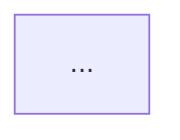

# Cortex Frontmatter Skill

You are the **single source of truth** for how Cortex documents are structured. When any other skill (research, brainstorm, etc.) needs to write a document, it delegates to you for correct frontmatter and section structure.

## Base Frontmatter (all systems)

Every Cortex document starts with these YAML frontmatter fields:

```yaml
---
created: YYYY-MM-DD        # required -- today's date
title: "Human-readable title"  # required
type: research              # required -- see doc types below
tags: [tag1, tag2]          # lowercase, no spaces, kebab-case
project: my-project         # kebab-case project identifier
status: draft               # draft | reviewed | final | archived
---
```

### Field rules

| Field | Required | Format | Notes |
|-------|----------|--------|-------|
| `created` | Yes | `YYYY-MM-DD` | Always today's date for new docs |
| `title` | Yes | String | Human-readable, sentence case |
| `type` | Yes | Enum | See doc types below |
| `tags` | No | String array | Lowercase, kebab-case, 3-8 tags recommended |
| `project` | No | String | Kebab-case. Omit for global/cross-project docs |
| `status` | No | Enum | Defaults to `draft` |
| `updated` | No | `YYYY-MM-DD` | Set when editing existing docs |

## Systems

### Default system

Used for engineering repos and project documentation. Base fields only -- no extras needed.

### PARA system

Used for personal organization and global docs. Adds one field:

```yaml
para: project | area | resource | archive
```

**When to use PARA:** Only when the user explicitly requests it or when writing to a personal knowledge base (not a project repo).

## Doc Types and Section Structures

### `research`

```markdown
## Summary
One paragraph overview of findings.

## Key Findings
- Finding 1
- Finding 2

## Details
Extended analysis, organized by subtopic.

## Sources
- [Source 1](url) -- brief annotation
- [Source 2](url) -- brief annotation

## Open Questions
- Unanswered question 1
- Unanswered question 2
```

### `brainstorm`

```markdown
## Context
What prompted this brainstorm. Link to prior research if it exists.

## Questions
Key questions we're trying to answer.

## Approaches
### Approach 1: Name
- Pros
- Cons
- Effort estimate

### Approach 2: Name
- Pros
- Cons
- Effort estimate

## Decision
Which approach and why. Or "No decision yet -- needs more research."

## Next Steps
- [ ] Action item 1
- [ ] Action item 2
```

### `plan`

```markdown
## Context
Link to brainstorm/research that led to this plan.

## Acceptance Criteria
- [ ] Criterion 1
- [ ] Criterion 2

## Implementation Order
1. Step 1
2. Step 2

## Verification
How to confirm the plan worked.
```

### `meeting`

```markdown
## Attendees
- Person 1
- Person 2

## Agenda
1. Topic 1
2. Topic 2

## Notes
Discussion notes organized by agenda item.

## Action Items
- [ ] @person -- action item
```

### `decision`

```markdown
## Context
What decision needed to be made and why.

## Options Considered
### Option 1: Name
- Pros / Cons

### Option 2: Name
- Pros / Cons

## Decision
What was decided and the reasoning.

## Consequences
What this decision means going forward.
```

### `diagram`

Diagram docs use `## <Label>` section headings for each diagram type (e.g. `## Flowchart`, `## Mind Map`, `## Entity-Relationship Diagram`). Each section contains the diagram source in a fenced code block followed by an `**Export:**` annotation line. The code block language tag depends on the engine: `mermaid` for Mermaid diagrams, `markmap` for Markmap mind maps. This structure is uniform from the first write, so appending a second diagram type never requires restructuring.

```markdown
## Flowchart



**Export:** Classic theme, A4 landscape.
```

```markdown
## Mind Map

```markmap
# Topic
## Branch 1
## Branch 2
```

**Export:** Markmap engine, A4 landscape.
```

Additional frontmatter fields for diagram docs:

```yaml
engine: markmap                                  # optional -- mermaid (default) | markmap
source:                                          # always a YAML list, even for single sources
  - docs/brainstorms/YYYY-MM-DD-<topic>.md       # path(s) to origin document(s)
```

The `engine` field is only needed when using a non-default engine (currently only Markmap for mind maps). Omit for Mermaid diagrams.

## File Naming Convention

All Cortex documents follow this naming pattern:

```
YYYY-MM-DD-<descriptive-slug>.md
```

- Date prefix for chronological sorting
- Slug is kebab-case, descriptive, 3-6 words
- Examples: `2026-02-27-yaml-frontmatter-best-practices.md`

## File Location

| Context | Location |
|---------|----------|
| No project context / global | `~/code/my-agent-cortex/docs/<type>/` |
| Working in a project repo | `~/code/<project>/docs/<type>/` |

Where `<type>` maps to the directory:
- `research` -> `docs/research/`
- `brainstorm` -> `docs/brainstorms/`
- `plan` -> `docs/plans/`
- `meeting` -> `docs/meetings/`
- `decision` -> `docs/decisions/`
- `diagram` -> `docs/diagrams/`

## Writing Rules

1. **Never skip frontmatter** -- every doc gets the full YAML block
2. **Title matches filename** -- the title should be derivable from the slug
3. **Tags are discovery aids** -- include technology names, domain terms, related projects
4. **Status starts as draft** -- only the user promotes to reviewed/final
5. **Use em dashes sparingly** -- prefer regular dashes (-) or double hyphens (--)
