# Syntax Reference

Complete syntax for all Mermaid diagram types. Each section shows the declaration keyword, minimal example, and key syntax rules.

## Flowchart

The workhorse. Handles processes, workflows, decisions, and most general-purpose diagrams.

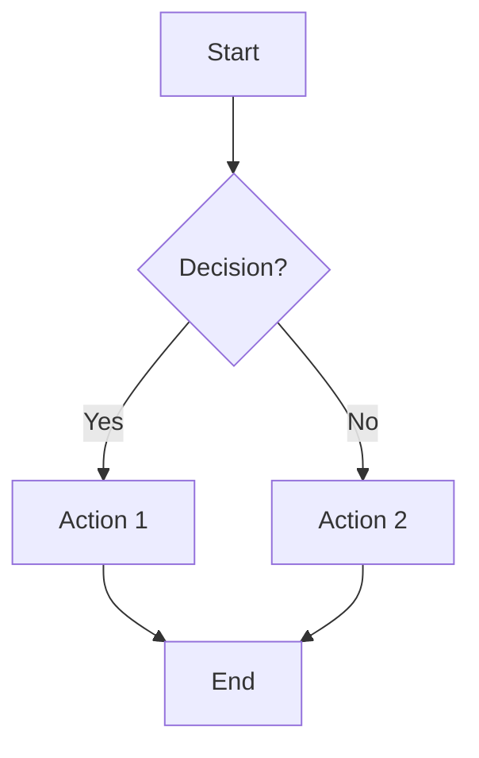

**Direction:** `TD` (top-down), `LR` (left-right), `RL`, `BT` (bottom-up)

**Node shapes:**

| Syntax | Shape | Semantic |
|--------|-------|----------|
| `[text]` | Rectangle | Process |
| `(text)` | Rounded rectangle | Terminal |
| `([text])` | Stadium | Start/end |
| `{text}` | Diamond | Decision |
| `{{text}}` | Hexagon | Preparation |
| `((text))` | Circle | Connector |
| `[(text)]` | Cylinder | Database |
| `[/text/]` | Parallelogram | I/O |
| `[\text\]` | Parallelogram (reversed) | I/O |
| `[[text]]` | Subroutine | Function call |
| `[/text\]` | Trapezoid | Manual operation |
| `[\text/]` | Trapezoid (reversed) | Manual operation |
| `(((text)))` | Double circle | Emphasis |
| `>text]` | Asymmetric | Flag/signal |

**Edge types:**

| Syntax | Type |
|--------|------|
| `-->` | Arrow |
| `---` | Open link (no arrow) |
| `-.->`| Dotted arrow |
| `==>` | Thick arrow |
| `--x` | Cross end |
| `--o` | Circle end |
| `-->\|label\|` | Arrow with label |
| `-. label .->` | Dotted with label |
| `== label ==>` | Thick with label |

**Subgraphs:**

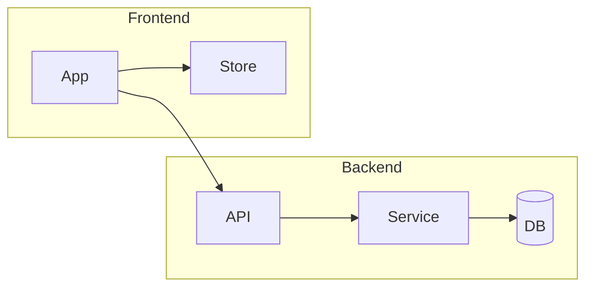

## Sequence Diagram

Interactions between actors/systems over time.

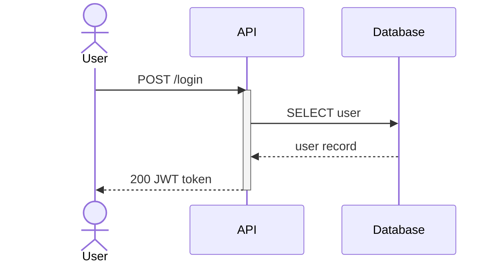

**Arrow types:**

| Syntax | Meaning |
|--------|---------|
| `->>` | Solid with arrowhead (request) |
| `-->>` | Dashed with arrowhead (response) |
| `-)` | Solid with open arrow (async) |
| `--)` | Dashed with open arrow (async response) |
| `-x` | Solid with cross (failure) |
| `--x` | Dashed with cross |

**Features:**
- `activate`/`deactivate` for lifelines
- `Note over A,B: text` for annotations
- `alt`/`else`/`end` for conditionals
- `loop`/`end` for repetition
- `par`/`and`/`end` for parallel execution
- `critical`/`option`/`end` for critical sections
- `rect rgb(200, 220, 240)` for background highlights

## Mind Map

Hierarchical ideas, brainstorms, topic exploration.

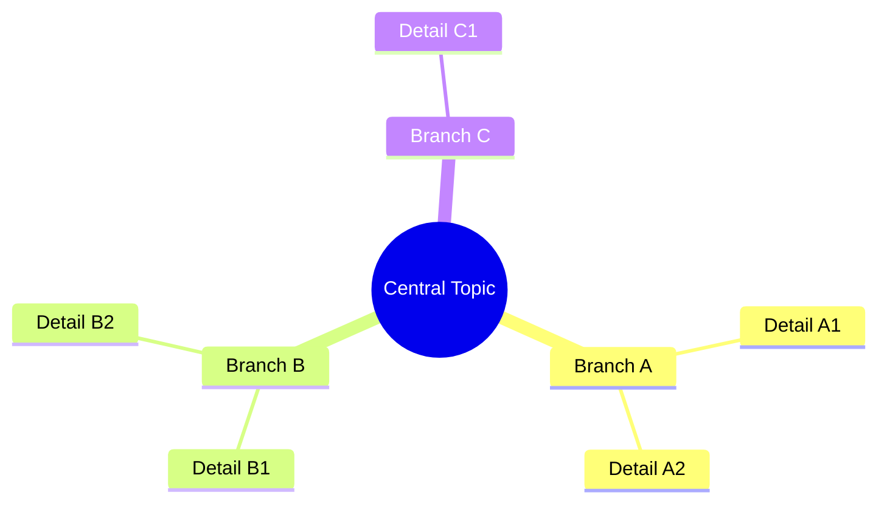

**Rules:**
- Indentation defines hierarchy (use consistent spacing)
- Root node uses `(( ))` for circle emphasis
- Keep to 3-5 main branches
- 2-3 details per branch max for print readability
- Node shapes: `[square]`, `(rounded)`, `((circle))`, `)cloud(`, `{{hexagon}}`

## Class Diagram

Object models, type systems, interface hierarchies.

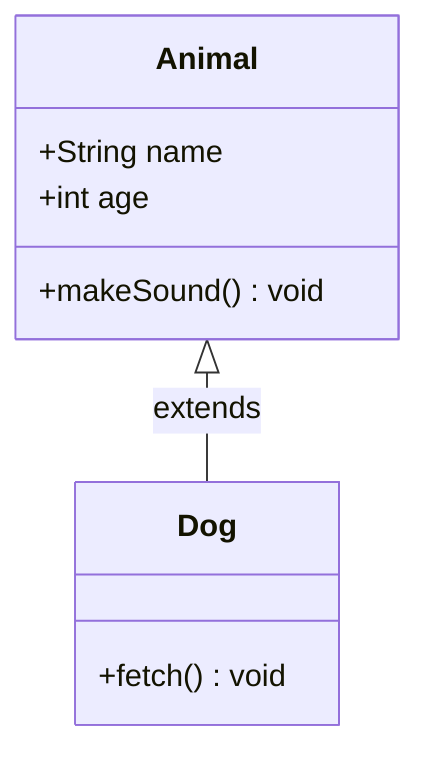

**Relationships:**

| Syntax | Meaning |
|--------|---------|
| `<\|--` | Inheritance |
| `*--` | Composition |
| `o--` | Aggregation |
| `-->` | Association |
| `..>` | Dependency |
| `..\|>` | Realization |

**Visibility:** `+` public, `-` private, `#` protected, `~` package

## State Diagram

Lifecycles, state machines, status flows.

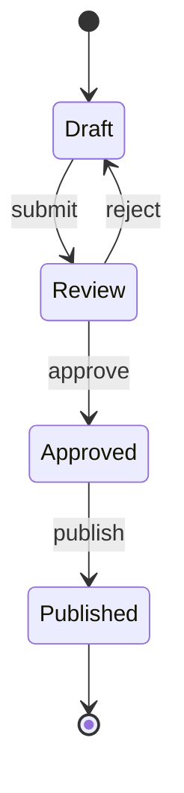

**Features:**
- `[*]` for start/end states
- `state "Description" as s1` for aliases
- `state fork_state <<fork>>` for fork/join
- `state if_state <<choice>>` for conditional
- Nested states with `state "Group" { ... }`

## Entity Relationship Diagram

Data models, database schemas.

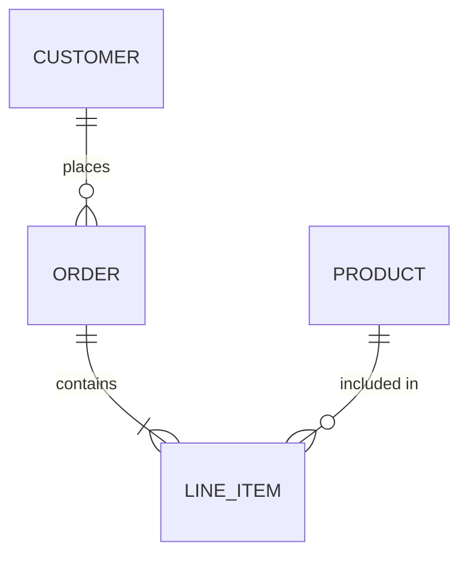

**Cardinality notation:**

| Symbol | Meaning |
|--------|---------|
| `\|\|` | Exactly one |
| `\|o` | Zero or one |
| `}\|` | One or more |
| `}o` | Zero or more |

**Line types:** `--` solid (identifying), `..` dashed (non-identifying)

**Entity attributes:**

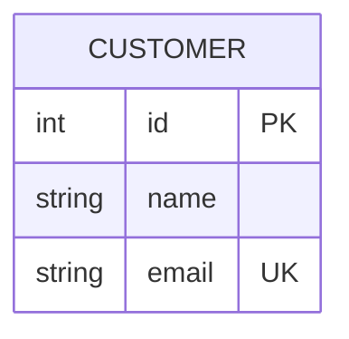

## Gantt Chart

Timelines, project schedules.

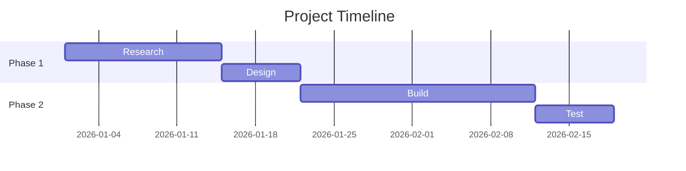

**Task modifiers:** `done`, `active`, `crit` (critical path), `milestone`

## Pie Chart

Simple proportions and distributions.

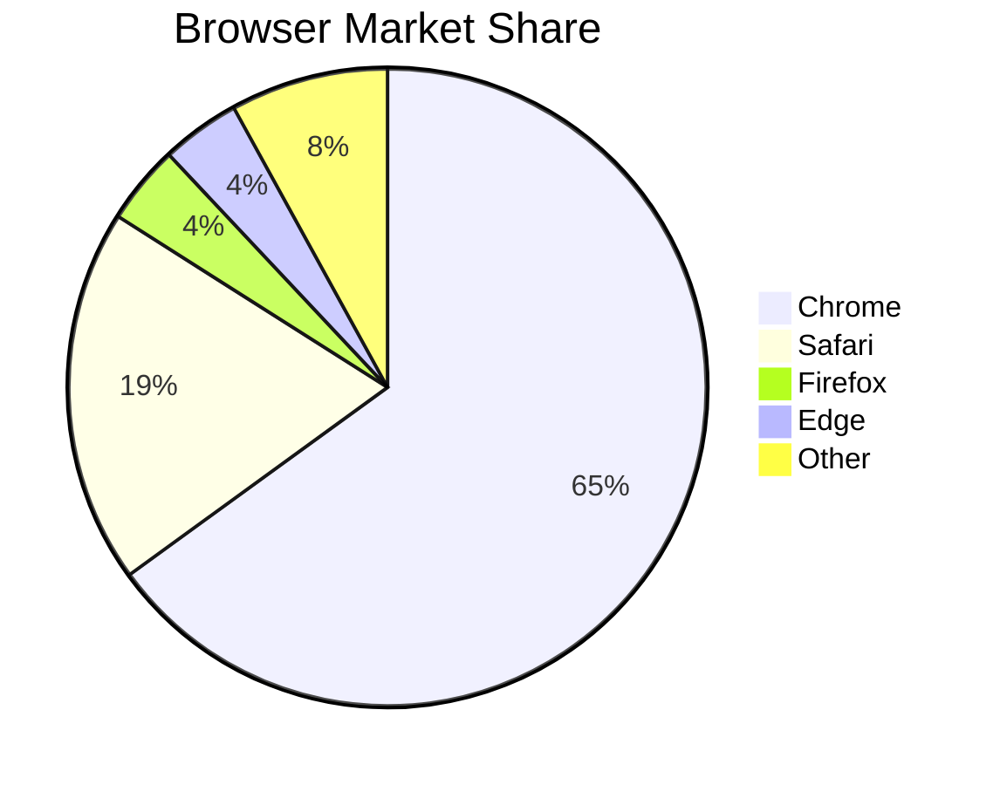

Values must be positive. Slices render clockwise in order.

## Timeline

Chronological events.

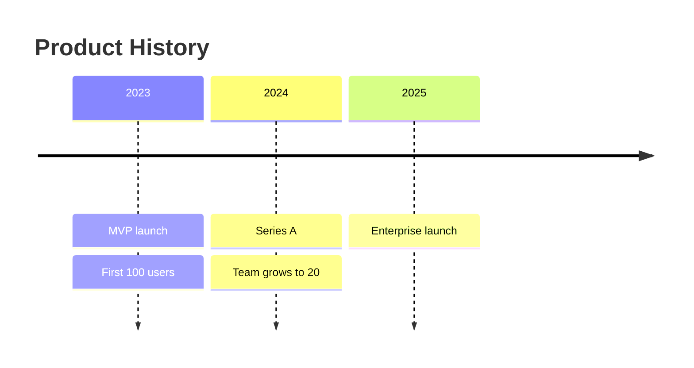

## Architecture Diagram

System components and connections (beta).

```mermaid
architecture-beta
    group api(cloud)[API Layer]
    group data(database)[Data Layer]

    service gateway(server)[Gateway] in api
    service auth(lock)[Auth] in api
    service db(database)[PostgreSQL] in data

    gateway:R --> L:auth
    auth:B --> T:db
```

**Components:** `group`, `service`, `junction`
**Icons:** `cloud`, `database`, `disk`, `server`, `internet`, `lock`
**Edges:** Specify ports with `:T` (top), `:B` (bottom), `:L` (left), `:R` (right)

## Block Diagram

Layout-driven generic blocks (beta).

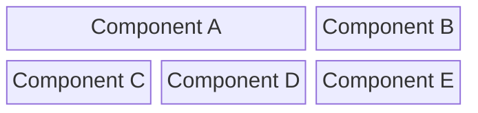

**Features:** `columns N` for grid layout, `:N` for column span, `space` for empty cells.

## Quadrant Chart

2x2 priority matrices.

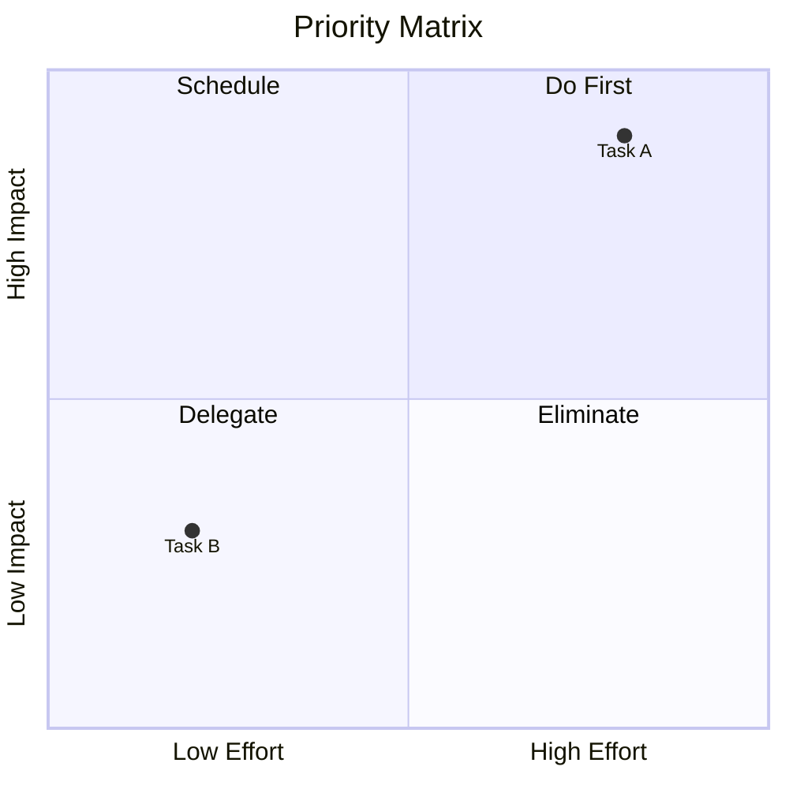

Coordinates are 0-1 range. Quadrants numbered 1 (top-right) to 4 (bottom-left).

## Sankey Diagram

Flow volumes between nodes (beta).

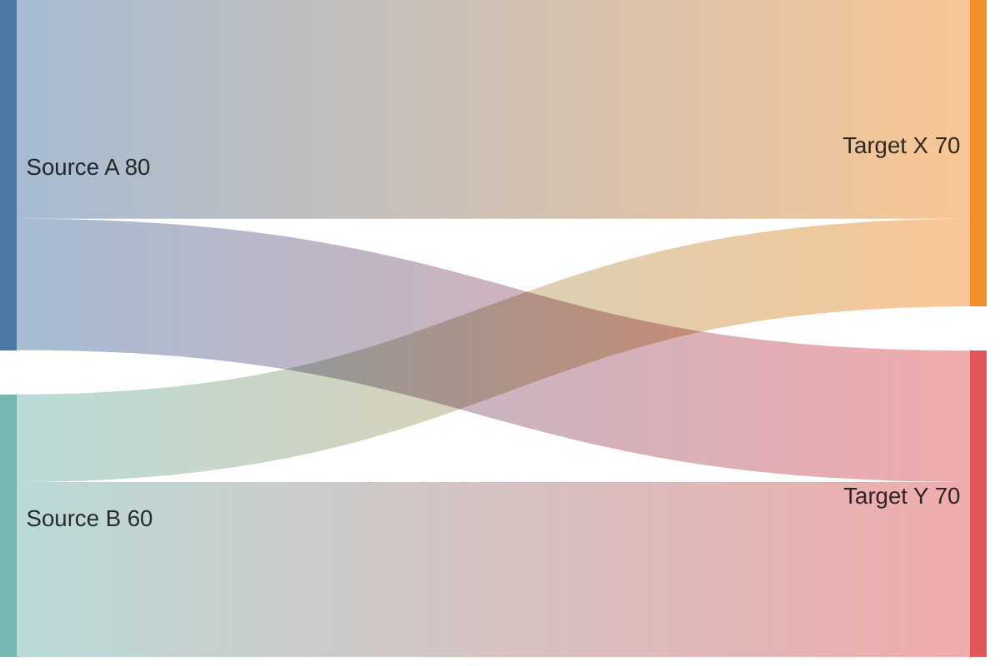

CSV-like syntax: `source,target,value` per line.

## XY Chart

Line and bar charts (beta).

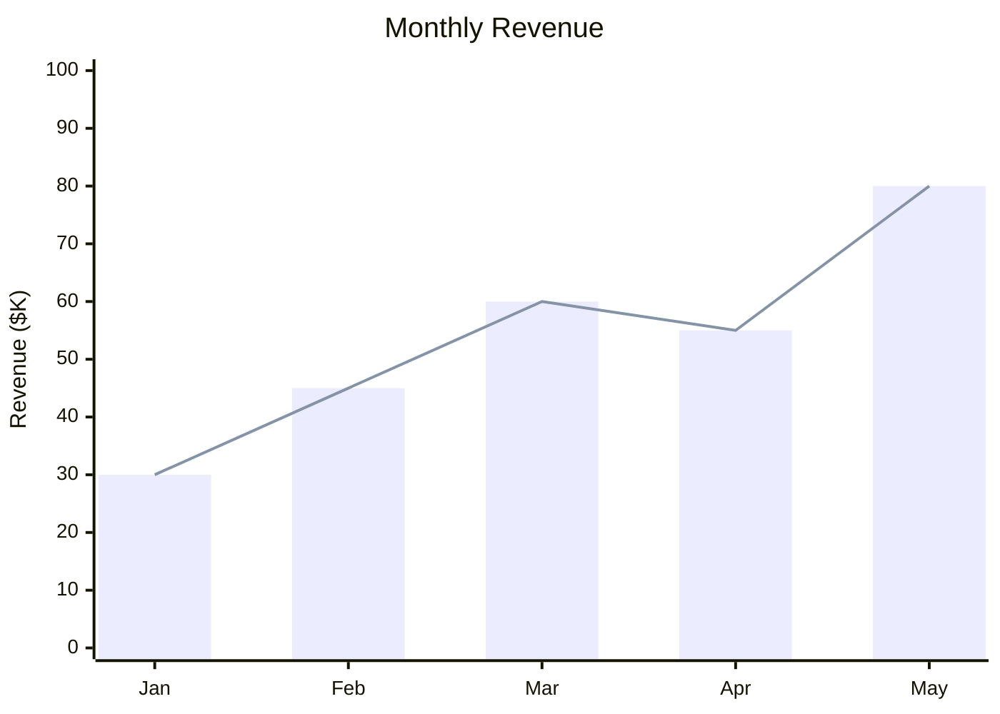

## User Journey

Task completion across actors.

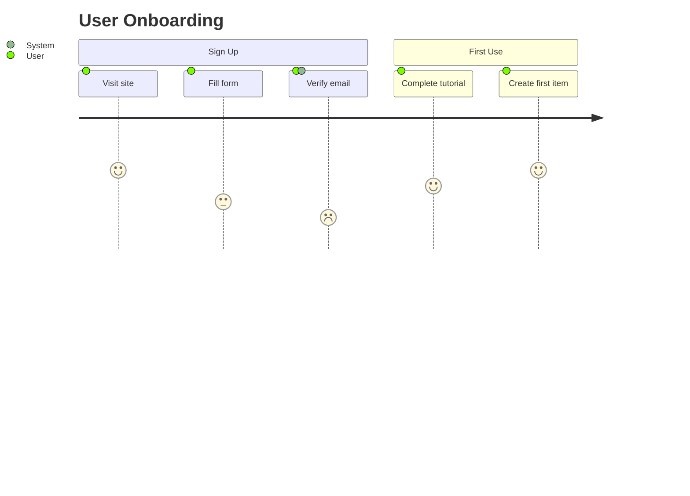

Score is 1-5 (1 = frustrating, 5 = delightful).

## Treemap

Hierarchical data as nested rectangles (beta).

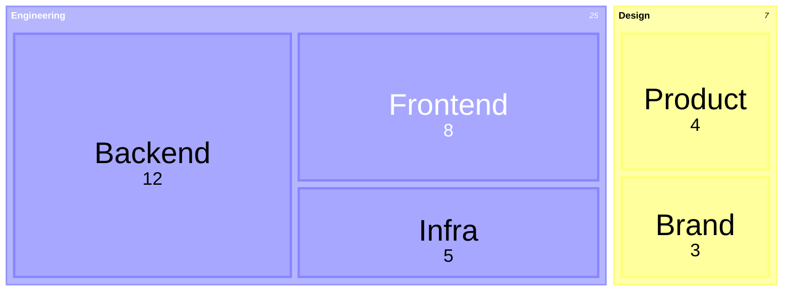

Section nodes contain child nodes. Leaf nodes have `: value` for sizing.

## Kanban

Board-style task tracking.

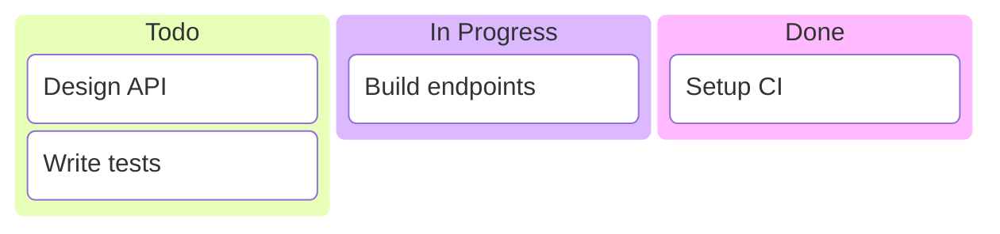

## Requirement Diagram

Requirements traceability.

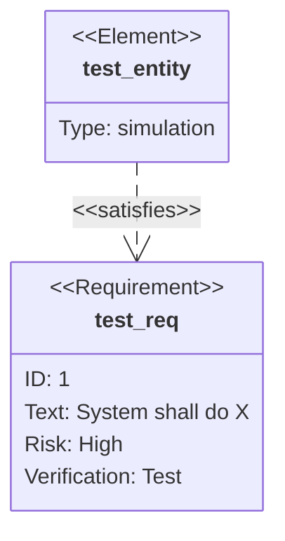
