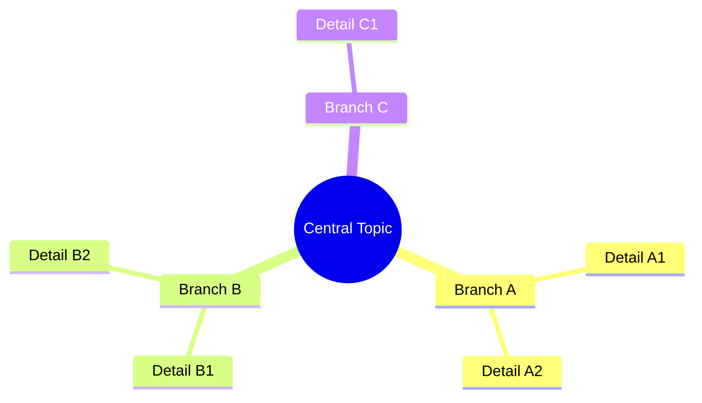
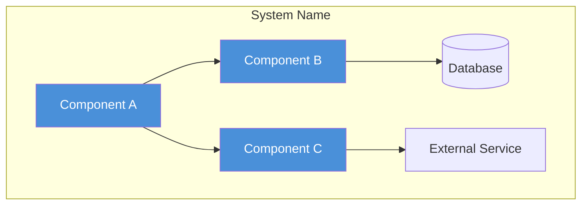
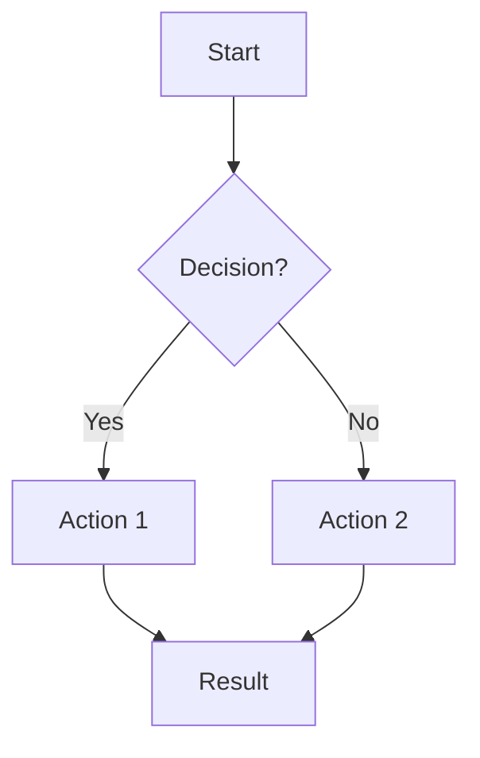
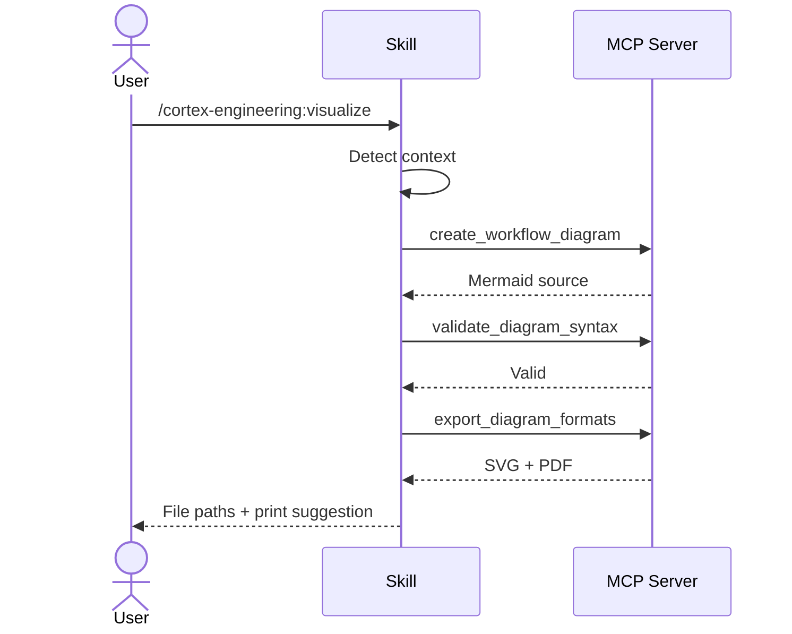

# Diagram Templates

Mermaid syntax templates for each diagram type. Use these as starting points when generating diagrams.

## Mind Map

Best for brainstorms and research -- shows how topics connect.

**Tips:**
- Root node uses `(( ))` for emphasis
- Keep to 3-5 main branches
- 2-3 details per branch max for readability at print scale

## Architecture (C4 Component)

Best for plans and system designs -- shows component structure.

**Tips:**
- Use `TB` (top-bottom) for hierarchical systems
- Use `LR` (left-right) for pipelines and flows
- Group related components with `subgraph`
- Use `[( )]` for databases, `{{ }}` for decisions

## Flowchart

Best for processes and workflows -- shows step-by-step flow.

**Tips:**
- Use `{ }` for decision points
- Label edges with `|text|` for clarity
- Keep linear paths vertical, branches horizontal
- End with a single terminal node when possible

## Sequence Diagram

Best for interactions between components or actors.

**Tips:**
- Use `actor` for people, `participant` for systems
- Use `->>` for requests, `-->>` for responses
- Alias long names: `participant MCP as MCP Server`
- Keep to 5-8 interactions for print readability
