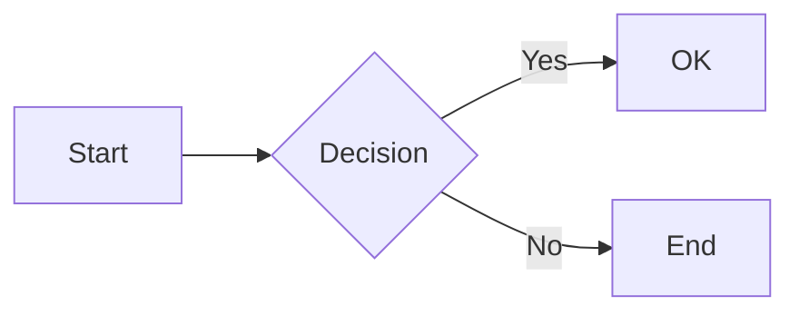
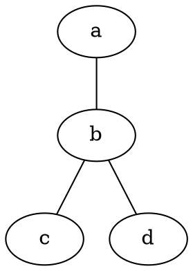

# MPE Diagrams Reference

Last verified: 2026-03-03 | Source: [MPE diagrams docs](https://shd101wyy.github.io/markdown-preview-enhanced/#/diagrams)

## Table of Contents

- [Mermaid](#mermaid)
- [PlantUML](#plantuml)
- [GraphViz / DOT](#graphviz--dot)
- [Vega and Vega-Lite](#vega-and-vega-lite)
- [WaveDrom](#wavedrom)
- [Kroki](#kroki)
- [Ditaa](#ditaa)
- [Common Attributes](#common-attributes)
- [Gotchas](#gotchas)

## Mermaid

**Syntax:** ` ```mermaid `

**Requirements:** None (built-in)

**Themes:** Three CSS themes available via `mermaidTheme` setting:
- `default` (mermaid.css)
- `dark` (mermaid.dark.css)
- `forest` (mermaid.forest.css)

**Config:** Edit via Command Palette > "Markdown Preview Enhanced: Open Mermaid Config"

**Icon packs:** Register through `head.html` customization.

**Example:**
````

````

## PlantUML

**Syntax:** ` ```puml ` or ` ```plantuml `

**Requirements:** Java must be installed and on PATH. Graphviz optional (needed for some diagram types).

**Auto-wrapping:** MPE automatically inserts `@startuml` / `@enduml` if missing.

**Server mode:** Set `plantumlServer` to use a remote PlantUML server instead of local Java.

**Example:**
````
```puml
Alice -> Bob: Hello
Bob --> Alice: Hi
```
````

## GraphViz / DOT

**Syntax:** ` ```viz ` or ` ```dot `

**Requirements:** None (uses viz.js, runs in browser)

**Engines:** `circo`, `dot` (default), `neato`, `osage`, `twopi`

**Select engine:**
````

````

## Vega and Vega-Lite

**Syntax:** ` ```vega ` or ` ```vega-lite `

**Requirements:** None (built-in)

**Input:** JSON or YAML

**Import support:** Use file imports with `{as="vega-lite"}` attribute:

```
@ import "chart.json" {as="vega-lite"}
```

**Example:**
````
```vega-lite
{
  "data": {"url": "data.csv"},
  "mark": "point",
  "encoding": {
    "x": {"field": "x", "type": "quantitative"},
    "y": {"field": "y", "type": "quantitative"}
  }
}
```
````

## WaveDrom

**Syntax:** ` ```wavedrom `

**Requirements:** None (built-in)

**Variants:**
- ` ```wavedrom ` -- timing diagrams
- ` ```bitfield ` -- bit field / register diagrams

**Example:**
````
```wavedrom
{ signal: [
  { name: "clk", wave: "p......." },
  { name: "dat", wave: "x.345x..", data: ["a", "b", "c"] }
]}
```
````

## Kroki

**Syntax:** Add `kroki=true` or `kroki=DIAGRAM_TYPE` to any code block attributes.

**Requirements:** Internet access (uses external Kroki service at `kroki.io`)

**Server:** Configurable via `krokiServer` setting. Default: `https://kroki.io`

**Supported diagram types:** All types supported by Kroki (BlockDiag, BPMN, ByteField, Excalidraw, Pikchr, Structurizr, etc.)

**Example:**
````
```pikchr {kroki=true}
arrow right 200% "Rqst" above
box "Service" fit
arrow right 200% "Resp" above
```
````

## Ditaa

**Syntax:** ` ```ditaa `

**Requirements:** Java on PATH (uses PlantUML's built-in Ditaa support)

**Example:**
````
```ditaa
+--------+   +-------+
|        |-->| ditaa |
|  Text  |   +-------+
+--------+
```
````

## Common Attributes

These attributes work on any diagram code block:

| Attribute | Example | Description |
|-----------|---------|-------------|
| `code_block` | `{code_block=true}` | Show code without rendering diagram |
| `align` | `{align="center"}` | Horizontal alignment of rendered diagram |
| `filename` | `{filename="arch.png"}` | Filename for exported image |

## Gotchas

### PlantUML Java Path

PlantUML requires Java. If you get "Java not found" errors:
1. Verify: `java -version` in terminal
2. Set `JAVA_HOME` environment variable
3. Or set `plantumlJarPath` to the `.jar` file location
4. Or use `plantumlServer` for a remote server instead

### Export Compatibility

| Diagram Type | Puppeteer | HTML | Pandoc | GFM Markdown |
|-------------|-----------|------|--------|--------------|
| Mermaid | Yes | Yes | No | Converted to PNG |
| PlantUML | Yes | Yes | No | Converted to PNG |
| GraphViz | Yes | Yes | No | Converted to PNG |
| Vega/Vega-Lite | Yes | Yes | No | Converted to PNG |
| WaveDrom | Yes | Yes | No | Not supported |
| Kroki | Yes | Yes | No | Converted to PNG |

### Theme Consistency

Mermaid themes are set at the extension level (`mermaidTheme`), not per-diagram. If you need different themes per diagram, use the `mermaidConfig` in `config.js` with custom CSS overrides.

### Kroki Availability

Kroki diagrams require internet access to the Kroki server. For offline use, self-host a Kroki instance and update the `krokiServer` setting.
